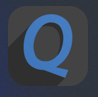
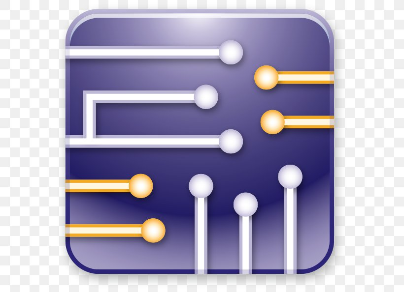

<h1 align="center">Hi 👋, I'm Ahmed Elmallah</h1>
<h3 align="center">Digital IC Design, ASIC & Embedded Systems Engineer</h3>
<!-- Custom Banner (Optional for extra visual appeal) -->
<!-- 

 -->

---

## 📖 About Me

<picture>
  
</picture>

- ✨ Ex-Trainee at NTI Summer Internship **"Embedded Systems"**
- 💻 Currently learning **Verilog, ASIC flow, and Verification**
- 🤝 Seeking collaboration in **Digital IC design, ASIC, and Embedded Systems projects**
- 🏆 [My Certificates](https://drive.google.com/drive/folders/14-u85-Ebpf3BUTBbFtHe7nY7Fq0dF-lw?usp=drive_link)
- 📄 [My CV](https://drive.google.com/drive/folders/1u8ybywlZaPokYGkHRuHXSvoQmTv3hxsn?usp=drive_link)
- 📧 Email: **ahmedellmallah@gmail.com**
- 📱 WhatsApp: **+201025724159**

---

## 🌐 Connect with Me

  
  

  
  

---

## 🛠 Skills

### 💻 Languages

  <code></code>
  <code></code>
  <code></code>
  <code></code>
  <code></code>

### ⚙ Tools & Platforms

  <code></code>
  <code></code>
  <code></code>
  <code></code>
  <code></code>
  <code></code>
  <code></code>
  <code></code>
  <code></code>
  

---

## 🚀 Featured Projects

<!-- Insert 2-3 top project repos here for visibility and professionalism -->
- **FPGA-based PWM Controller**: Real-world driver implementation using Verilog and VHDL
- **Embedded Systems Monitoring App**: Python/C-powered tool for live board diagnostics
- **ASIC DSP Module**: RTL design and verification with ModelSim and Vivado

---

## 📊 GitHub Stats

  
  

  

---

<!-- For further dynamism, consider widgets like blog showcase or animated contribution graph. -->

_Last updated: September 2025_
